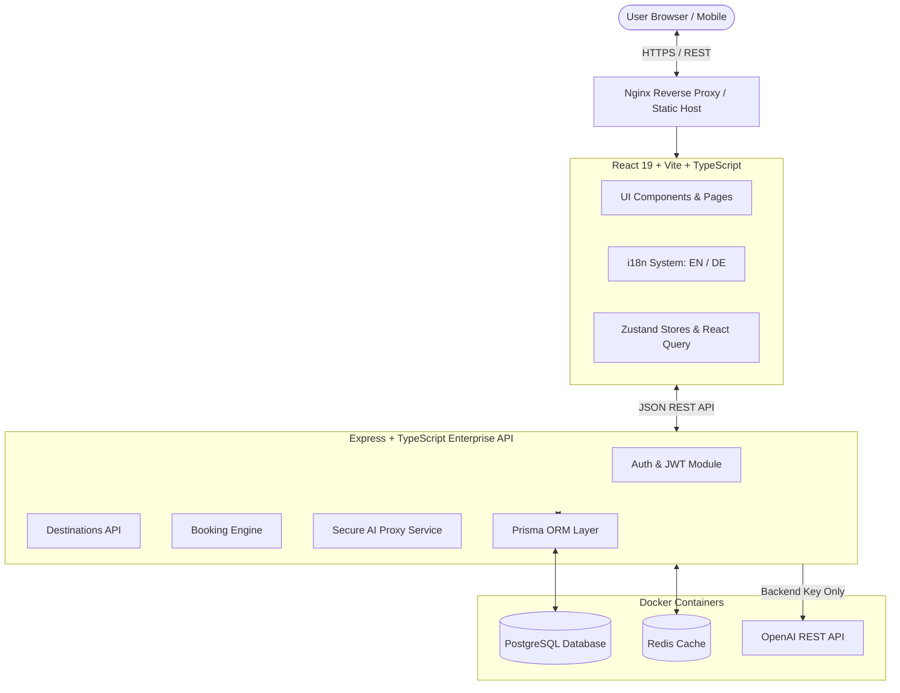
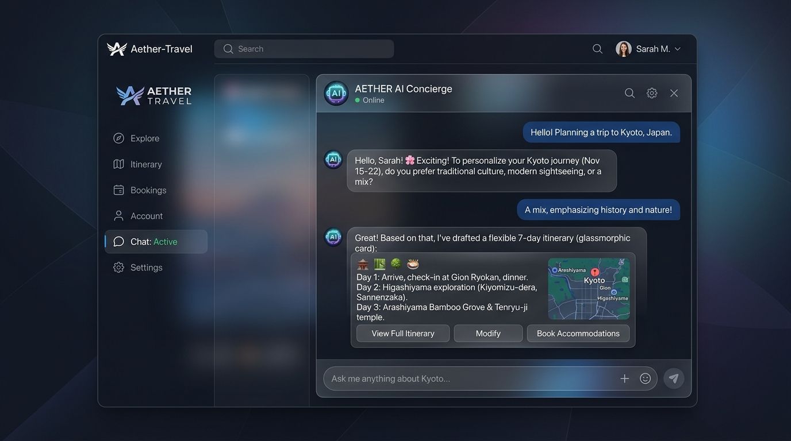

# ✈️ Aether-Travel — Enterprise AI-Powered SaaS Travel Platform

[](https://github.com/NohaCode-lab/Aether-Travel/actions/workflows/ci.yml)
[](https://www.typescriptlang.org/)
[](https://react.dev/)
[](https://expressjs.com/)
[](https://www.prisma.io/)
[](https://www.docker.com/)
[](LICENSE)

**Aether-Travel** is a state-of-the-art, enterprise-grade AI-powered travel planning and itinerary management SaaS platform. Designed with modern cloud-native principles, it combines React 19, TypeScript, Express, Prisma ORM, PostgreSQL, Redis, and a secure backend AI Concierge proxy to deliver intelligent, personalized travel itineraries across multiple languages (Bilingual: English & German).

---

## ✨ Features & Platform Capabilities

- 🤖 **Secure AI Travel Concierge:** Interactive AI trip architect that generates day-by-day itineraries, attraction guides, and budget recommendations without exposing API keys to the browser.
- 🌐 **Bilingual Internationalization (i18n):** Native support for **English** and **Deutsch (German)** with dynamic language switching and persistent user preferences.
- 🗺️ **Destination Discovery Engine:** Interactive destination catalog featuring real-time search, price per night estimates, ratings, and tag filtering.
- 📅 **SaaS Booking & Reservation System:** Complete booking lifecycle allowing travelers to reserve destinations, manage bookings, and track reservation statuses (`PENDING`, `CONFIRMED`, `CANCELLED`).
- ⚡ **Real-Time Caching & Queues:** Built-in Redis caching and background processing architecture.
- 🛡️ **Enterprise Security Hardening:** Strict API authorization, input validation with Zod, non-root Docker execution, and Trivy security scanning.

---

## 🛠️ Technology Matrix

| Layer | Technologies & Tools |
|---|---|
| **Frontend** | React 19, Vite 5, TypeScript 5.7, Tailwind CSS v3/v4, Zustand 5, TanStack React Query v5, Lucide Icons |
| **Internationalization** | `i18next`, `react-i18next`, `i18next-browser-languagedetector` (EN 🇬🇧 / DE 🇩🇪) |
| **Backend API** | Node.js 22, Express, TypeScript, JWT Auth, Zod Validation |
| **Database & ORM** | PostgreSQL 16, Prisma ORM 6.3 |
| **Caching & Queues** | Redis 7, BullMQ |
| **AI Integration** | OpenAI GPT-3.5/4 API (Secured server-side) |
| **DevOps & Containerization** | Docker (Multi-stage builds), Docker Compose, Nginx |
| **Testing & Quality** | Vitest, React Testing Library, Playwright E2E, ESLint 9 |

---

## 📐 System Architecture



---

## 🚀 Getting Started

### Prerequisites
- **Node.js**: `v20.x` or `v22.x`
- **npm**: `v10.x`
- **Docker & Docker Compose** (Optional for containerized run)

---

### ⚙️ Installation & Setup

1. **Clone the Repository:**
   ```bash
   git clone https://github.com/NohaCode-lab/Aether-Travel.git
   cd Aether-Travel
   ```

2. **Configure Environment Variables:**
   ```bash
   cp .env.example .env
   cp backend/.env.example backend/.env
   ```

3. **Install Frontend & Backend Dependencies:**
   ```bash
   npm install
   cd backend && npm install && cd ..
   ```

4. **Run Development Servers:**
   ```bash
   # Start Frontend (Vite)
   npm run dev

   # In a separate terminal, start Backend API
   cd backend && npm run dev
   ```

---

## 🐳 Docker Production Setup

Spin up the entire stack (Frontend, Backend API, PostgreSQL, and Redis) with a single command:

```bash
docker-compose up --build -d
```

- **Frontend Application:** `http://localhost`
- **Backend REST API:** `http://localhost:4000`
- **API Health Check:** `http://localhost:4000/health`

---

## 🧪 Testing & Quality Assurance

```bash
# Run ESLint check (Target: 0 errors, 0 warnings)
npm run lint

# Run TypeScript type check
npm run typecheck

# Run Vitest unit & component tests
npm test

# Run production build validation
npm run build
```

---

## 🖼️ Application Screenshots & Portfolio Previews

| Dashboard Overview | AI Travel Concierge |
|:---:|:---:|
|  |  |

---

## 📄 License
This project is open-source and available under the [MIT License](LICENSE).