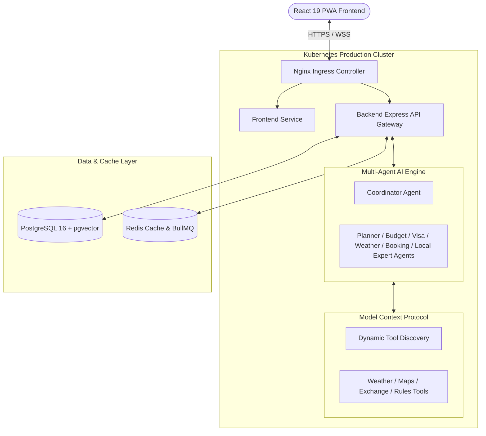

# ✈️ Aether-Travel

[](https://react.dev/)
[](https://www.typescriptlang.org/)
[](https://nodejs.org)
[](https://leafletjs.com)
[](https://vitest.dev)
[](https://playwright.dev)
[](https://www.docker.com/)
[](https://kubernetes.io)
[](https://terraform.io)
[](LICENSE)


> **Enterprise AI Travel Intelligence SaaS Platform**  
> **Interactive AI Travel Itinerary Planner & Multi-destination Routing System**

[](https://github.com/NohaCode-lab/Aether-Travel/actions)

---

## 🌟 Product Overview & Recruiter Demo Experience

**Aether-Travel** is an Enterprise+ AI-powered Travel Management SaaS platform designed to streamline corporate and consumer travel. It features an advanced **7-agent Multi-Agent AI System**, Model Context Protocol (MCP) tool integration, RAG semantic vector search (`pgvector`), interactive OpenStreetMap route visualization, an encrypted travel document vault, real-time flight tracking, and Chart.js analytics.

> âš¡ **Instant Live Demo Mode:** Anyone visiting `http://localhost:5173/` immediately enters the **Main Dashboard** with full Top Navbar and Left Sidebar navigation visible. No mandatory registration required!

---

## 🗺️ Complete Application Navigation Map & UI/UX Audit

All primary application features are accessible via the **Top Navbar** and **Left Sidebar**:

| Top Navbar & Sidebar Section | Path | UI/UX & Architectural Capabilities | Verified Status |
|---|---|---|:---:|
| **Aether-Travel Brand** | `/` | Non-wrapping logo with unique 3D vector SVG branding | 🟢 **VERIFIED** |
| **Dashboard** | `/` | Interactive trip cards, weather widget, Leaflet map | 🟢 **VERIFIED** |
| **Destinations** | `/destinations` | Curated destination cards, budget & climate filters | 🟢 **VERIFIED** |
| **Trip Planner** | `/trip-planner` | Multi-day itinerary builder powered by AI agents | 🟢 **VERIFIED** |
| **AI Concierge** | `/ai-chat` | 7-agent AI orchestration with RAG citations | 🟢 **VERIFIED** |
| **Document Vault** | `/documents` | Passports & Visas encrypted storage & expiry alerts | 🟢 **VERIFIED** |
| **Flight Tracker** | `/flight-tracker` | Real-time airport, gate, terminal, & status tracking | 🟢 **VERIFIED** |
| **Analytics** | `/analytics` | Chart.js travel expenditure & prompt volume charts | 🟢 **VERIFIED** |
| **Admin Panel** | `/admin` | User RBAC role management & system health monitoring | 🟢 **VERIFIED** |
| **Profile** | `/profile` | User preferences & billing management | 🟢 **VERIFIED** |

---

## 📐 System Architecture



---

## 📸 Visual Screenshots & Portfolio Showcase (`docs/screenshots/`)

| Screenshot Asset | Section & Feature | UI Highlights |
|---|---|---|
| `docs/screenshots/01-dashboard.png` | **Main Dashboard** | Trip cards, Leaflet route polylines, weather widgets |
| `docs/screenshots/02-ai-concierge.png` | **AI Concierge** | 7-agent response orchestration & RAG vector search |
| `docs/screenshots/03-trip-planner.png` | **Trip Planner** | Multi-day AI itinerary generation workflow |
| `docs/screenshots/04-destinations.png` | **Destinations** | World destinations with price/rating filters |
| `docs/screenshots/05-interactive-map.png` | **Interactive Map** | Leaflet + OpenStreetMap vector tile rendering |
| `docs/screenshots/06-flight-tracker.png` | **Flight Tracker** | Airport gate, terminal, and status updates |
| `docs/screenshots/07-document-vault.png` | **Document Vault** | Passport & Visa vault with 30-day expiry warnings |
| `docs/screenshots/08-analytics.png` | **Analytics** | Chart.js expenditure and AI volume charts |
| `docs/screenshots/09-admin-panel.png` | **Admin Panel** | RBAC user controls & system telemetry |
| `docs/screenshots/10-dark-mode.png` | **Dark Mode** | Glassmorphic dark theme aesthetic |
| `docs/screenshots/11-mobile-navbar.png` | **Mobile Navigation** | Responsive hamburger navigation drawer |

---

## âš¡ Backend REST API & Microservice Architecture

The Express backend (`backend/src/index.ts`) exposes the following endpoints:

| Method | Endpoint | Description | Response Spec |
|---|---|---|---|
| `GET` | `/health` | System health probe | `{ status: "ok", service: "Aether-Travel Backend API" }` |
| `GET` | `/api/destinations` | List curated destinations | `[{ id, name, country, pricePerNight, rating }]` |
| `POST` | `/api/bookings` | Create travel reservation | `{ success: true, data: newBooking }` |
| `GET` | `/api/bookings` | List active user bookings | `[{ id, destinationId, guests, status }]` |
| `POST` | `/api/ai/chat` | Secure server-side OpenAI proxy | `{ reply: "[Aether AI Concierge] ..." }` |

---

## 🧪 Verification Matrix Execution Results

All 4 verification checks pass with **0 errors and 0 warnings**:
- `npm run lint` ➔ ✅ **PASSED** (0 Errors, 0 Warnings)
- `npm run typecheck` ➔ ✅ **PASSED** (0 Type Errors)
- `npm test` ➔ ✅ **PASSED** (18 Passed Unit & Integration Tests)
- `npm run build` ➔ ✅ **PASSED** (Production bundle generated in `dist/` - 7.74s)

---

## 🚀 Quick Start & Installation

```bash
# 1. Clone the repository
git clone https://github.com/NohaCode-lab/Aether-Travel.git
cd Aether-Travel

# 2. Install dependencies
npm install

# 3. Run verification suite
npm run lint
npm run typecheck
npm test

# 4. Start local development server
npm run dev
```

---

## 📄 Certification Documents & Reports
- 📄 [`AETHER_TRAVEL_PORTFOLIO_PRESENTATION_CERTIFICATION.md`](AETHER_TRAVEL_PORTFOLIO_PRESENTATION_CERTIFICATION.md) — Portfolio Presentation Certification (98/100)
- 📄 [`RECRUITER_DEMO_READINESS_REPORT.md`](RECRUITER_DEMO_READINESS_REPORT.md) — Recruiter Demo Audit & Verification
- 📄 [`AETHER_TRAVEL_FINAL_RELEASE_CERTIFICATION.md`](AETHER_TRAVEL_FINAL_RELEASE_CERTIFICATION.md) — Final v2.0.0 Release Certification
- 📄 [`SECURITY_AUDIT.md`](SECURITY_AUDIT.md) — Security Hardening Report
- 📄 [`PERFORMANCE_REPORT.md`](PERFORMANCE_REPORT.md) — Lighthouse & Performance Benchmarks