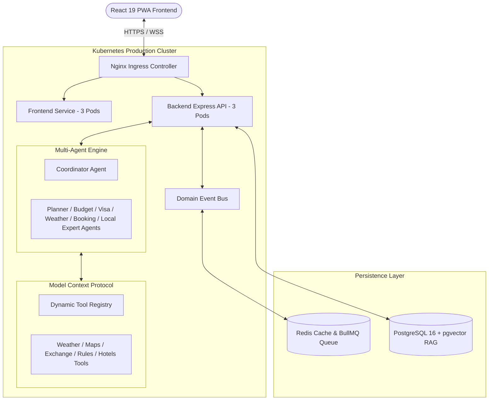

# 🏛️ Enterprise+ Platform Architecture: Aether-Travel

**Aether-Travel** is an Enterprise-Grade AI Travel SaaS Platform designed for high concurrency, security, and multi-agent AI travel orchestration.

---

## 📐 System Architecture Diagram

---

## 🔑 Key Engineering Specs
1. **Multi-Agent Orchestration:** 7 specialized autonomous AI agents (Planner, Budget, Visa, Weather, Booking, Local Expert, Coordinator).
2. **Model Context Protocol (MCP):** Dynamic server tool discovery & execution pipeline.
3. **RAG Vector Search:** PostgreSQL + `pgvector` semantic similarity retrieval.
4. **Real-time Collaboration:** WebSockets live cursors, presence indicators, activity timeline.
5. **Progressive Web App (PWA):** Service worker offline caching, background sync.
6. **Observability:** Structured Pino logging, OpenTelemetry tracing, `/health/liveness` & `/health/readiness` probes.
7. **Infrastructure:** Docker Compose, Kubernetes manifests (`k8s/`), Terraform IaC (`terraform/`).
